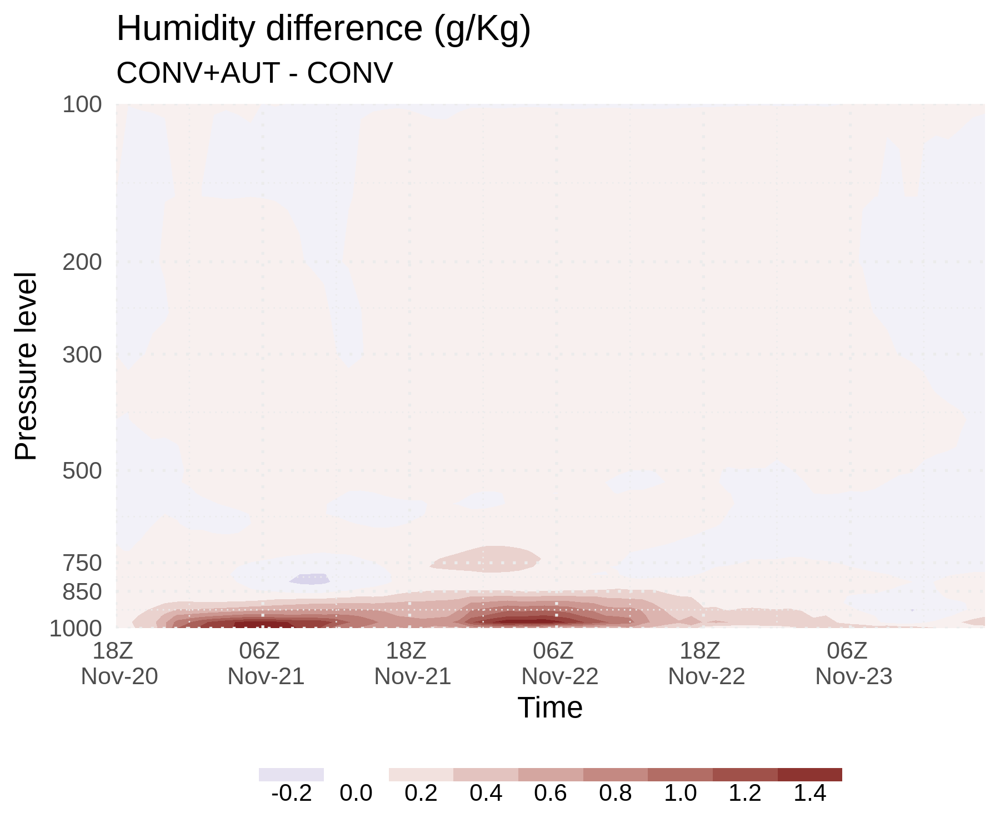
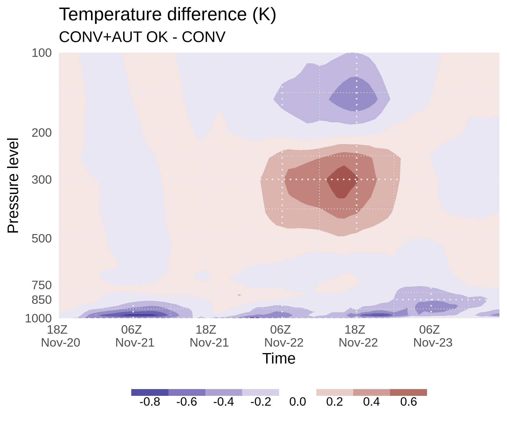
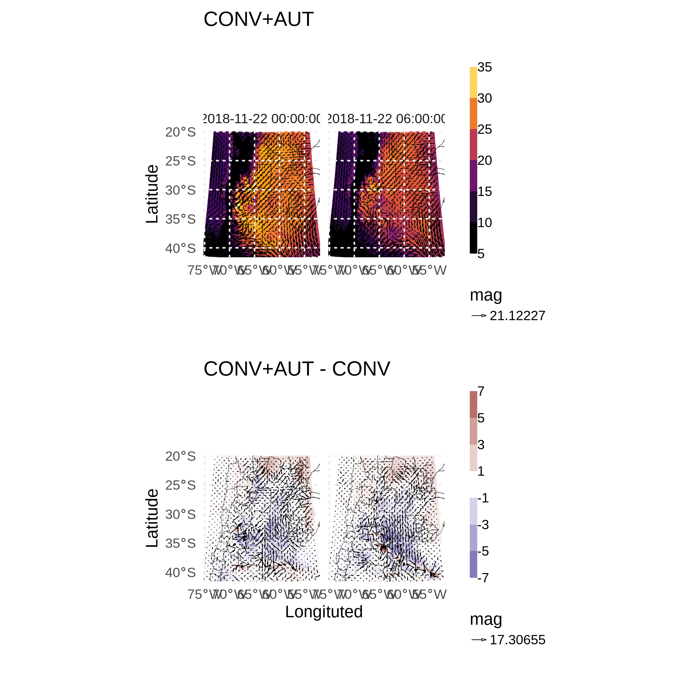

```{r setup, include=FALSE}
knitr::opts_chunk$set(echo = TRUE)

library(metR)
library(ggplot2)
library(lubridate)
library(magrittr)
library(data.table)
```

# Impacto de las observaciones convencionales

Para evaluar el impacto de las observaciones asimiladas se van a comparar dos experimentos de asimilación:

* CONV: donde se asimilan solo las observaciones del prepBUFR.
* CONV+AUT: donde se asimilan las observaciones del prepBUFR y de la red de estaciones automáticas de la región.


## Diferencia en la vertical

Las siguientes figuras muestran la diferencia en la humedad absoluta y la temperatura entre los dos experimentos a lo largo de todo el periodo de asimilación. Se realizó una interpolación a niveles de presión y luego se calculó un promedio espacial para obtener un perfil vertical en cada tiempo.

La diferencia en la humedad absoluta es importante solo en niveles bajos por debajo de 850-900 hPa. Esto parece ser razonable ya que la mayoría de las observaciones asimiladas son de superficie. En general CONV+AUT tiene valores de humedad más altos cerca de superficie. Por el contrario, la diferencia en la temperatura es importante en todos los niveles. En niveles bajos la diferencia tiene una especie de ciclo diario que se suaviza cuando la convección empieza a desarrollarse en el dominio. También llama la atención el calentamiento en niveles medios/altos durante el 22 y un enfriamientos por arriba. 

> **Será posible que la convección esté ayudando a propagar el efecto de las observaciones en superficie? Porque no se ve en la humedad?**

{width=45%} {width=45%} 

### Update

Otra manera de analizar el impacto que generan las observaciones es calculando el "update" o sea la diferencia entre el análisis y el guess (que en este caso es un pronóstico a una hora).

Para la temperatura, el update ocurre en todos los niveles. Esto es así porque en todas las horas hay observaciones de aviones en distintos niveles, a lo que se suman los sondeos en algunas horas específicas. 

En el caso de la humedad, el update es importante en niveles bajos solamente con una "burbuja" de humedad el día de mayor convección. Si bien las observaciones de humedad de aviones parecen no existir (al menos en algunos prepbufrs) y de sondeo (no se asimilan, por la configuración de GSI, pero se podría cambiar).


```{r echo=FALSE, warning=FALSE}
E5_tq <- fread("analisis/perfil_lev_T_Q_ana_E5.csv") %>% 
  .[fread("analisis/perfil_lev_T_Q_guess_E5.csv"), on = c("lev", "date")] %>% 
  .[, date := ymd_hms(date)] %>% 
  setnames(c("T", "QVAPOR", "i.T", "i.QVAPOR"), c("T_ana", "Q_ana", "T_guess", "Q_guess")) %>% 
  .[, `:=`(T_update = T_ana - T_guess,
           Q_update = Q_ana - Q_guess,
           exp = "CONV+AUT")]

E4_tq <- fread("analisis/perfil_lev_T_Q_ana_E4.csv") %>% 
  .[fread("analisis/perfil_lev_T_Q_guess_E4.csv"), on = c("lev", "date")] %>% 
  .[, date := ymd_hms(date)] %>% 
  setnames(c("T", "QVAPOR", "i.T", "i.QVAPOR"), c("T_ana", "Q_ana", "T_guess", "Q_guess")) %>% 
  .[, `:=`(T_update = T_ana - T_guess,
           Q_update = Q_ana - Q_guess,
           exp = "CONV")]

rbind(E5_tq, E4_tq) %>%  
 # .[exp == "CONV"] %>% 
  ggplot(aes(date, lev)) +
  geom_contour_fill(aes(z = T_update), breaks = seq(-0.6, 0.6, 0.1)) +
  scale_fill_divergent(name = NULL,
                       breaks = seq(-0.6, 0.6, 0.1),
                       guide = guide_colorstrip(inside = TRUE,
                                                barwidth = 25,
                                                barheight = 0.8),
                       label = function(x) round(x, 2)) +
  labs(title = "Temperature update (K)",
       x = "Time",
       y = "Pressure level") +
  scale_y_level(name = "Pressure level", breaks = c(1000, 850, 750, 500, 300, 200, 100)) +
  scale_x_datetime(expand = c(0,0), date_labels = "%HZ \n %b-%d", date_breaks = "12 hours") +
  facet_wrap(~exp) +
  theme_minimal() +
  theme(legend.position = "bottom",
        panel.ontop = TRUE,
        panel.grid = element_line(linetype = 3))


rbind(E5_tq, E4_tq) %>%  
 # .[exp == "CONV"] %>% 
  ggplot(aes(date, lev)) +
  geom_contour_fill(aes(z = Q_update*1000), breaks = seq(-0.3, 0.6, 0.1),) +
  scale_fill_divergent(name = NULL,
                       breaks = seq(-0.3, 0.6, 0.1),
                       guide = guide_colorstrip(inside = TRUE,
                                                barwidth = 25,
                                                barheight = 0.8),
                       label = function(x) round(x, 2)) +
  labs(title = "Humidity update (g/Kg)",
       x = "Time",
       y = "Pressure level") +
  scale_y_level(name = "Pressure level", breaks = c(1000, 850, 750, 500, 300, 200, 100)) +
  scale_x_datetime(expand = c(0,0), date_labels = "%HZ \n %b-%d", date_breaks = "12 hours") +
  facet_wrap(~exp) +
  theme_minimal() +
  theme(legend.position = "bottom",
        panel.ontop = TRUE,
        panel.grid = element_line(linetype = 3))
```

### Update en niveles

```{r echo=FALSE, warning=FALSE}
E5_tq <- fread("analisis/campo_lev_T_Q_ana_E5.csv") %>% 
  .[fread("analisis/campo_lev_T_Q_guess_E5.csv"), on = c("lev", "date", "south_north", "west_east")] %>% 
  .[, date := ymd_hms(date)] %>% 
  setnames(c("T", "QVAPOR", "i.T", "i.QVAPOR"), c("T_ana", "Q_ana", "T_guess", "Q_guess")) %>% 
  .[, `:=`(T_update = T_ana - T_guess,
           Q_update = Q_ana - Q_guess,
           exp = "CONV+AUT")]

E4_tq <- fread("analisis/campo_lev_T_Q_ana_E4.csv") %>% 
  .[fread("analisis/campo_lev_T_Q_guess_E4.csv"), on = c("lev", "date", "south_north", "west_east")] %>% 
  .[, date := ymd_hms(date)] %>% 
  setnames(c("T", "QVAPOR", "i.T", "i.QVAPOR"), c("T_ana", "Q_ana", "T_guess", "Q_guess")) %>% 
  .[, `:=`(T_update = T_ana - T_guess,
           Q_update = Q_ana - Q_guess,
           exp = "CONV")]
```

```{r echo=FALSE, warning=FALSE}
E5_tq[lev == 500] %>% 
  ggplot(aes(west_east, south_north)) +
  geom_contour_fill(aes(z = T_update), breaks = seq(-4, 4, 1)) +
  scale_fill_divergent(name = "Update",
                       breaks = seq(-4, 4, 1),
                       guide = guide_colorstrip(inside = TRUE,
                                                barwidth = 25,
                                                barheight = 0.8)) +
  geom_contour(data = E4_tq[lev == 500], aes(z = T_update, linetype = factor(-sign(..level..))), 
               color = "black",
               size = 0.3,
               breaks = seq(-4, 4, 1)) +
  scale_linetype_discrete(guide = "none") +
  facet_wrap(~factor(date)) +
  coord_equal() +
  labs(title = "500 hPa") +
  theme_minimal() +
  theme(legend.position = "bottom",
        panel.ontop = TRUE,
        panel.grid = element_line(linetype = 3))

E5_tq[lev == 200] %>% 
  ggplot(aes(west_east, south_north)) +
  geom_contour_fill(aes(z = T_update), breaks = seq(-4, 4, 1)) +
  scale_fill_divergent(name = "Update",
                       breaks = seq(-4, 4, 1),
                       guide = guide_colorstrip(inside = TRUE,
                                                barwidth = 25,
                                                barheight = 0.8)) +
  geom_contour(data = E4_tq[lev == 200], aes(z = T_update, linetype = factor(-sign(..level..))), 
               color = "black",
               size = 0.3,
               breaks = seq(-4, 4, 1)) +
  scale_linetype_discrete(guide = "none") +
  facet_wrap(~factor(date)) +
  coord_equal() +
  labs(title = "200 hPa") +
  theme_minimal() +
  theme(legend.position = "bottom",
        panel.ontop = TRUE,
        panel.grid = element_line(linetype = 3))
```


## Diferencias en la horizontal 

Si observamos la distribución espacial de la humedad en distintos tiempos (promediando los niveles de presión entre  1000 y 900 hPa), vemos que en general el experimento CONV+AUT genera un entorno más húmedo hasta el sur de Córdoba y centro de Buenos Aires. 

> **Será porque el viento del norte es más intenso en este experimento?**

{width=80%}

Pero si observamos el campo de la diferencia del viento en el nivel más bajo en la siguiente figura, en general, el viento del norte es menos intenso en CONV+AUT (se observa como viento del sur en la figura pero en realidad indica que la magnitud del viento en CONV+AUT es menor que en CONV). De hecho a las 06Z del 22/11 el viento en niveles bajos pierde intensidad en la región central del dominio. 

{width=80%}

En las tres variables analizadas se observa una zona al sur de Córdoba y Buenos Aires (donde podría estar ubicado el frente, habría que revisar esto) donde las diferencias entre los dos experimentos es muy importante. Si comparamos estas figuras con la imagen de IR del GOES-16, vemos que la linea donde se genera la convección se ubica donde las diferencias entre los análisis es mayor. Si bien solo con esto es imposible saber si el impacto de las observaciones de superficie fue positivo (o sea que acerca la simulación al estado real de la atmósfera), es interesante ver que el impacto se da justo donde ocurren los procesos que nos interesan. 

> **Es posible que en los experimentos la convección se desarrolle en lugares ligeramente distintos o desfazados en el tiempo y eso genera las diferencias que se ven el gráfico. Sería interesante intentar ver donde hay convección en cada caso**


### Reflectividad

```{r}
# map <- rnaturalearth::ne_states(country = c("argentina", "Brazil", "Chile", "Uruguay", "Paraguay", "Bolivia"), returnclass = "sf")
map <- sf::read_sf("mapa/mapa.shp")

geom_mapa <- function() {
  geom_sf(data = map, fill = NA, color = "black", size = 0.2, inherit.aes = FALSE)
}

dbz <- ReadNetCDF("analisis/dbz/maxdbz_ana_E5_20181122060000.nc", vars = c(dbz = "max_dbz", lon = "XLONG", lat = "XLAT")) %>% 
  .[, exp := "CONV+AUT"]

dbz_E4 <- ReadNetCDF("analisis/dbz/maxdbz_ana_E4_20181122060000.nc", vars = c(dbz = "max_dbz", lon = "XLONG", lat = "XLAT")) %>% 
  .[, exp := "CONV"]

pal <- wesanderson::wes_palette("Zissou1", 100, type = "continuous")

rbind(dbz, dbz_E4) %>% 
  .[dbz > 15] %>% 
  ggplot(aes(lon, lat)) +
  geom_point(aes(color = dbz), size = 0.3) +
  scale_color_gradientn(colors = pal) +
  geom_mapa() +
  coord_sf(xlim = range(dbz$lon), ylim = range(dbz$lat)) +
  labs(title = "Reflectividad máxima mayor a 15 dbz",
       subtitle = "2018-11-22 06:00:00") +
  facet_wrap(~exp) +
  theme_minimal()
```

## Observaciones

Vamos a reconocer que hay un elefante en la sala y que algo en el sistema de asimilación no está funcionando como debería. Vamos a analizar las observaciones asimiladas por cada experimento.

```{r echo=FALSE}

# files <- list.files("analisis/diagfiles/", recursive = TRUE, full.names = TRUE, pattern = "asim_conv")
files <- Sys.glob("analisis/diagfiles/E[4-5]/asim_conv*")

obs <- purrr::map(files, function(f) { 
  diag <- fread(f) %>% 
    .[, exp := basename(dirname(f))] %>% 
    .[, date := ymd_hms(stringr::str_extract(f, "\\d{14}"))] %>% 
    .[]
  }) %>% 
  rbindlist() %>% 
  .[, c("V2", "V4") := NULL]

colnames(obs) <- c("var", "stationID", "type", "dhr", "lat", "lon", "pressure", "usage.flag", "flag.prep", "obs", "obs.guess", "obs2", "obs.guess2", "rerr", "exp", "date")

obs[, .N, by = .(exp, var, usage.flag)] %>% 
  dcast(exp + usage.flag ~ var, value.var = "N") %>% 
  knitr::kable()
```

De esta figura me preocupan varias cosas:

* El pico de observaciones un poco antes de las 00Z del 22 --> Creo que puede tener que ver con que agregué dos veces las mismas observaciones al archivo (si no existe lo crea, si existe agrega lo que le pases sin revisar nada). No sería tan grave.
* La cantidad de observaciones rechazadas (línea a trazos), sobre todo en la humedad. En la presión no me molesta porque estoy agregando observaciones de estaciones automáticas que no tienen esa observación y entonces cuando mira p rechaza el registro.
* El cambio en uv justo antes de las 00Z del 22 --> Como que de repente las que se rechazaban se dejan de rechazar. Habré usado la rutina incorrecta para codificar las observaciones de estaciones automáticas A MITAD DE CAMINO?

*Update: TODO ARREGLADO!!*

```{r echo=FALSE}
obs[, .N, by = .(var, date, exp, usage.flag)] %>% 
  ggplot(aes(date, N)) +
  geom_line(aes(color = exp, linetype = factor(usage.flag))) +
  scale_linetype_manual(values = c("-1" = 2, "1" = 1)) +
  facet_wrap(~var, scales = "free") +
  labs(title = "Cantidad de observaciones asimiladas y rechazadas según variable",
       linetype = "Uso", 
       color = "experimento") +
  theme_minimal()
```
Respecto del segundo punto: Todas las observaciones tipo 181 de humedad son rechazadas. Resulta que me olvide de sacar el -1 en el archivo *convinfo*. Parece que hice lo mismo para uv (tipo 287).

```{r echo=FALSE}
obs[var == "t", .N, by = .(var, type, date, exp, usage.flag)] %>% 
  ggplot(aes(date, N)) +
  geom_line(aes(color = factor(type))) +
  geom_point(aes(color = factor(type))) +
  facet_wrap(usage.flag ~ exp, scales = "free") +
  labs(title = "Observaciones de temperatura",
       linetype = "Uso", 
       color = "type") +
  theme_minimal()

obs[var == "q", .N, by = .(var, type, date, exp, usage.flag)] %>% 
  ggplot(aes(date, N)) +
  geom_line(aes(color = factor(type))) +
  geom_point(aes(color = factor(type))) +
  facet_wrap(usage.flag ~ exp, scales = "free") +
  labs(title = "Observaciones de humedad",
       linetype = "Uso", 
       color = "type") +
  theme_minimal()

obs[var == "uv", .N, by = .(var, type, date, exp, usage.flag)] %>% 
  ggplot(aes(date, N)) +
  geom_line(aes(color = factor(type))) +
  geom_point(aes(color = factor(type))) +
  facet_wrap(usage.flag ~ exp, scales = "free") +
  labs(title = "Observaciones de viento",
       linetype = "Uso", 
       color = "type") +
  theme_minimal()
```

### Observaciones 287 no asimiladas, que pasó?

Muchas estaciones tienen datos faltantes, no siempre pero en algunos casos llegan a sumar 500 observaciones durante el experimento. Calculando la cantidad de observaciones por ciclo de asimilación da un promedio de 1800, aproximadamente lo que da en el gráfico.  

```{r echo=FALSE}
obs[var == "uv" & type == 287 & exp == "E5"] %>% 
  .[obs.guess < -10000] %>% 
  .[, .N, by = .(stationID, lon, lat)] %>% 
  .[] %>% 
  ggplot(aes(ConvertLongitude(lon), lat)) +
  geom_mapa() +
  coord_sf(xlim = c(-75, -50), ylim = c(-42, -20)) +
  geom_point(aes(color = N)) +
  labs(title = "Algunas estaciones tienen muchos NAs",
       subtitle = "Viento",
       x = "lon") +
  theme_minimal()

```

### Observaciones de aviones

Los prepbufrs contienen 3 tipos de observaciones provenientes de aviones:

- 130/230: AIREP
- 131/231: AMDAR
- 133/233: MDCRS ACARS

De los 3 tipos, 131/231 tiene más observaciones.
```{r echo=FALSE}
obs[type %in% c(130, 131, 133, 230, 231, 233) & exp == "E5"] %>% 
  .[, .N, by = .(type, usage.flag)] %>% 
  dcast(type~usage.flag)
```

Por ahora según la configuración de la **errtable** algunas observaciones de humedad no se asimilan (también está así en el archivo **convinfo**). Pero serán tan malas?

| tipo | temp | q | uv |
|:--:|:---:|:---:|:---:|
|130| 2.5 | NA | - |
|131| 1.47 | NA | - |
|133 |1.47 |1.94 | - |
|230| - | - | 3.6 |
|231 | - | - | 3.0 |
|233 | -  | - | 2.5 |

Veamos que pinta tiene la diferencia entre las observaciones y el guess.

```{r echo=FALSE}
obs[type %in% c(130, 131, 133)] %>% 
  .[] %>% 
  ggplot(aes(obs.guess)) +
  geom_density() +
  facet_grid(usage.flag~type, scale = "free_y")

obs[type %in% c(230, 231, 233)] %>% 
  .[] %>% 
  ggplot(aes(obs.guess)) +
  geom_density() +
  facet_grid(type ~ var)
```

```{r}
obs[type %in% c("131", "231") & exp == "E5"] %>% 
  ggplot(aes(obs.guess, pressure)) +
  geom_point(alpha = 0.01) +
  scale_y_level() +
  facet_grid(type ~ usage.flag)
```

```{r}
obs[type == 131 & exp == "E5" & date == "2018-11-22 00:00:00" & usage.flag == 1] 
  
  

```

