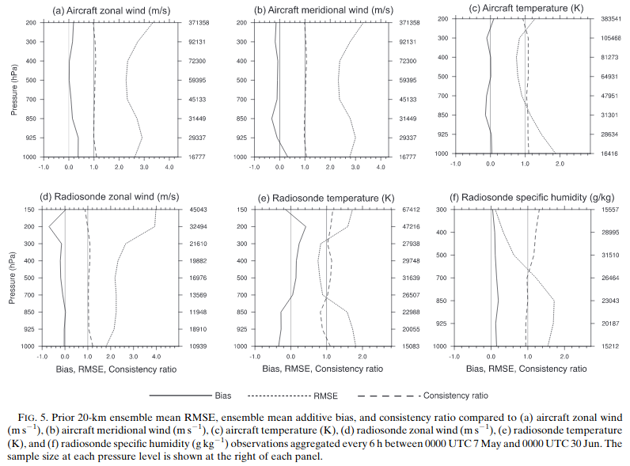

```{r setup, include=FALSE}
knitr::opts_chunk$set(echo = TRUE)
library(tidyverse)
library(lubridate)
library(data.table)
library(metR)
source("help_functions.R")
```

## Consistency ratio

De acuerdo con Schwartz 2015, en un sistema de asimilación/pronóstico bien calibrado al comparar con las observaciones, el error cuadrático medio de la media del prior ensamble (RMSE) va a ser *igual* al spread total del sprior, es decir, a la raiz cuadrada de la suma de la varianza del error de las observaciones y la varianza de las observaciones simuladas por el prior. 

Schwartz 2015 usa esto y calcula un *consistency ratio* (CR) o tasa entre el spread total y el RMSE. Si El CR es cercano a 1, el ensamble estará bien calibrado, un CR < 1 indica que el spread en insuficiente. Si CR > 1 entonces el spread es demasiado grande o tal vez se sobreestima el error de las observaciones.



Dowell y Wicker 2009 describen esta métrica matemáticamente. La inovación promediada en volumen $\left \langle d \right \rangle$ se calcula como:

$$d = y^o - \overline{H(\mathbf{x}^f)}$$

Donde los $\left \langle  \right \rangle$ denotan un promedio sobre las observaciones en un volumen determinado (en el caso del paper lo hace para cada volumen de radar, pero podría ser por región, podría ser un promedio temporal, etc.). El error cuadrático medio de la inovación se calcula como:

$$RMSE = \sqrt{ \left \langle (d - \left \langle d \right \rangle)^2 \right \rangle }$$
Y una medida del spread del ensamble incluyendo el error de la observación se calcula como:

$$spread=\sqrt{\sigma^2 + \left \langle \frac{1}{N-1}\sum_{n=1}^{N}[H(\mathbf{x}_n)-\overline{H(\mathbf{x})}]^2 \right \rangle} $$

Donde $\sigma^2$ dependerá de la oservación. 

Finalmente, como la estadística del ensamble debe podeer representar los errores del pronóstico y teniendo en cuenta que no conocemos los errores reales, calculamos la tasa de consistencia:

$$CR = \frac{\sigma^2_{vr} + \left \langle \frac{1}{N-1}\sum_{n=1}^{N}[H(\mathbf{x}_n)-\overline{H(\mathbf{x})}]^2 \right \rangle}{\left \langle (d-\left \langle d \right \rangle)^2 \right \rangle}$$

El $CR$ debería ser cercano a 1, un $CR < 1$ indica que el ensamble tiene un spread insuficiente y $CR > 1$ podría indicar una sobreestimación de los errores de las observaciones. 

### Implementación

```{r include=FALSE}
# path <- "analisis/diagfiles/E5/asim_conv_2018112*"
# 
# perfiles <- read_diag(path, variable = c("uv", "t")) %>% 
#   .[, c("error", "nivel.error") := input_obs_error(var, type, pressure)]
# 
# cr <- get_cr(perfiles[type %in% c(181, 187, 281, 287)], tipo = c("superficie", "temporal"))
# cr <- get_cr(perfiles[type %in% c(120, 130, 131, 133, 220, 230, 231, 233)], tipo = c("perfil", "temporal"))
# 
# fwrite(cr, "uvt_perfil_temporal.csv")
```

El la figura se muestra el CR a lo largo del tiempo para las observaciones de temperatura y viento en superficie (181 = con nivel de presión, 187 = sin nivel de presión). En primer lugar el CR es casi siempre mayor a 1 (inesperado) y en algunos casos llega a 100! En el caso de las observaciones de temperatura de 187 el CR es más cercano a lo esperado y coincide con que se calcula a partir de la mayor cantidad de observaciones. Comparando el viento meridional y el viento zonal, el CR del viento meridional es menor y más constante. 

En promedio el CR para todo el periodo de asimilación y cada variables es siempre mayor a 1.

```{r echo=FALSE}
fread("cr_uvt_superficie_temporal.csv") %>% 
  .[, date := ymd_hms(date)] %>% 
  .[is.finite(cr) & count > 1000] %>% 
  ggplot(aes(date, cr)) +
  geom_hline(yintercept = 1, color = "darkgrey") +
  # geom_hline(yintercept = 0.00001, color = "darkgrey") +
  geom_line(aes(color = factor(type), group = factor(type))) +
  geom_point(aes(color = factor(type), size = count)) +
  scale_x_datetime(date_labels = "%H", date_breaks = "3 hours") +
  scale_y_log10() +
  facet_wrap(~var, scales = "free_x", ncol = 1) +
  labs(title = "Consistency ratio",
       subtitle = "Surface observations",
       x = "hour",
       color = "Type of obs") +
  theme_minimal()

fread("cr_uvt_superficie.csv") %>%
  .[, .(var, type, count, cr)] %>% 
  knitr::kable()
```

Para las observaciones de sondeos y aviones (con variación vertical) calculé el CR para distintos niveles de presión. Nuevamente el CR es mayor a 1 y el peor caso es la temperatura de sondeos (120). 

```{r echo=FALSE}
fread("cr_uvt_perfil.csv") %>% 
  .[is.finite(cr) & count > 1000] %>% 
  ggplot(aes(nivel.error, cr)) +
  geom_hline(yintercept = 1, color = "darkgray") +
  geom_line(aes(color = factor(type))) +
  geom_point(aes(color = factor(type), size = count)) +
  scale_x_level() +
  coord_flip() +
  facet_wrap(~var, scales = "free_x") +
  labs(title = "Consistency ratio",
       subtitle = "Sounding and aircraft observations",
       x = "nivel",
       color = "Type of obs") +
  theme_minimal()
```

Viendo esto me pregunto si los errores para cada tipo de observación están correctamente definidos. *Supuestamente* al estar usando GSI regional, el sistema ignora el error de la observación que lee del prepbufr y usa los errores codificados en la tabla **errtable** que son los que usé para el cálculo del CR. 

## Reduced Centered Random Variable

De acuerdo a Candille et.al. 2006 un sistema de pronóstico por ensambls es confiable o es estadísticamente convincente si la observación $y^o$ es una realización independiente de la PDF (probality distribution function) generado por el ensamble. En otras palabras, si la observación es indistinguible de los valores predichos por el ensamble.

Sea $m$ la media y $\sigma$ el desvío estandar del ensamble y $\sigma_o$ el error de la observación, se define la *Reduced Centered Random Variable* $y$ como:

$$ y = \frac{y^o - m}{\sqrt{\sigma_o^2 +\sigma^ 2}} $$

El **primer momento** de $y$ corresponde al promedio sobre todas las realizaciones y representa el bis pesado entre el ensamble y la observación:

$$ b = E[y] $$

El **segundo momento** de $y$ es su desvío estandar y da cuenta de la sobre o infra dispersión sistemática del ensamble. Mide la relación entre el spread del ensamble y el error de la observación con la amplitud del error del pronóstico. 

$$ d = \sqrt{\frac{M}{M-1} E[(y-b)^2]} $$

El sistema de pronóstico por ensamble será confiable si $b=0$ es decir, sin bias; y $d = 1$ (con $d>1 \rightarrow underdispersive$ y $d<1 \rightarrow overdispersive$).

```{r echo=FALSE}
# RCRV <- get_RCRV(perfiles[type %in% c(120, 130, 131, 133, 220, 230, 231, 233)], tipo = c("perfil"))
# 
# fwrite(RCRV, "rcrv_uvt_perfil.csv")
```

### Implementación

Evaluamos el comportamiento de los dos primeros momentos de RCRV (*y*), *b=mean.y* y *d=sd.y* calculado para distintas observaciones. En el caso de las observaciones de superficie a lo largo del tiempo, la temperatura muestra casi siempre un *sd* mayor a 1 casi siempre indicando que el ensamble no tiene suficiente dispersión pero ocurre lo contrario para el viento. El bias tiene mayor variación a lo largo del tiempo. 

```{r echo=FALSE}
fread("rcrv_uvt_superficie_temporal.csv") %>% 
  .[, date := ymd_hms(date)] %>% 
  melt(measure.vars = c("mean.y", "sd.y")) %>% 
  ggplot(aes(date, value)) +
  geom_hline(yintercept = c(0, 1), color = "darkgray") +
  geom_line(aes(color = factor(type), linetype = variable)) +
  scale_x_datetime(date_breaks = "6 hours", date_labels = "%H:%m %b %d") +
  facet_wrap(~var, ncol = 1, scales = "free_y") +
  labs(title = "Reduced Centered Random Variable",
       subtitle = "Surface observations",
       color = "Obs type",
       linetype = "") +
  theme_minimal()

fread("rcrv_uvt_superficie.csv") %>% 
  knitr::kable()
```

Para las observaciones de aviones y sondeos, en algunos casos parece dar mal pero posiblemente sea porque hay pocas observaciones de ese tipo (por ejemplo 130). 

```{r echo=FALSE}
fread("rcrv_uvt_perfil.csv") %>% 
  melt(measure.vars = c("mean.y", "sd.y")) %>% 
  ggplot(aes(nivel.error, value)) +
  geom_hline(yintercept = c(0, 1), color = "darkgrey") +
  geom_line(aes(color = factor(type), linetype = variable)) +
  scale_x_level() +
  coord_flip() +
  facet_wrap(~ var, scales = "free_x") +
  labs(title = "Reduced Centered Random Variable",
       subtitle = "Sounding and aircraft observations",
       linetype = "",
       color = "Obs type") +
  theme_minimal()
  
```

## Conclusión...

Las dos métricas dan resultados muy distintos. Tengo entender que hace cada una para ver cual es el origen de la diferencia y con suerte encontrar alguna cuenta mal hecha. Pero en principio RCRV es mucho más simple de calcular!