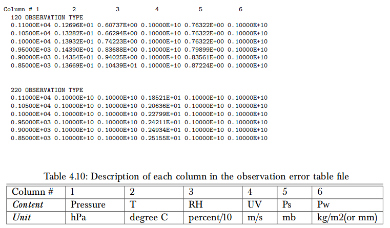

```{r setup, include=FALSE}
knitr::opts_chunk$set(echo = TRUE)
```

## El camino de las observaciones (convencionales)

### En GSI como operador de las observaciones

GSI lee las observaciones convecionales solo de archivo tipo [*prepBUFR*](https://dtcenter.org/com-GSI/BUFR/docs/users_guide/BUFR_PrepBUFR_User_Guide_v1.pdf) (BUFR con características específicas de NCEP). Cada observación en el prepBUFR está asociada a su localización, error y un marcador de control de calidad. 

Cuando el análisis es **global**, GSI lee los errores del prepBUFR o utiliza una tabla de errores predefinida (`oberrflg = .true.` en el namelist). Pero para un análisis **regional** siempre utiliza una tabla de errores *errtable* que se incluye en el directorio *./fix* (usamos prepobs_errtable.global modificado para poder asimilar observaciones tipo 181 y 281). La tabla tiene la sigueinte pinta:



El `NA` correspondiente es 0.10000E+10 y en ese caso la observación no se asimila. 

> Sobre cada tipo de observación --> [Table 2](https://www.emc.ncep.noaa.gov/mmb/data_processing/prepbufr.doc/table_2.htm)

GSI tiene la capacidad de hacer un *thinning* de las observaciones, según su tipo. Esto se activa modificando el algumento `ithin = 1` en el archivo *convinfo*.

A continuación hace un *gross check* que también se controla desde el archivo *convinfo* para cada tipo de observación cambiando el valor del umbral (`gross`), el error mínimo (`ermin`) y el error máximo (`ermax`). Se calcula un ratio como:

$$ ratio = (obs - bk)/max(ermin, min(ermax, obserror)) $$

Si $ration > gross$ la observación es rechazada. 

Internamente (en las rutinas `setup-var-.f90`) GSI puede modificar el valor que toma `gross` para penalizar observaciones con marcadores de control de calidad igual a 3 (entonces `gross = 0.7*gross`). 

Los marcadores de control de calidad se definen al crear el archivo prepBUFR pero además se modifican cuando las observaciones pasan por los controles de calidad previos a cualquier uso. Por defecto a las observaciones de estaciones meteorológicas de la región agregadas manualmente se les asignó un `qc = 2`. Puede tomar los sigueintes valores:

| qc | uso |
|:--:|:----|
| 0-2| --> Se asimila|
|3|Obs sospechosa --> se penaliza el gross check|
|4-15| --> Se rechaza (en algunos casos con qc 9 o 15 la observación se usa para monitoreo|

> Por detalles sobre los marcadores de controles de calidad [Table 7](https://www.emc.ncep.noaa.gov/mmb/data_processing/prepbufr.doc/table_7.htm)

[Al menos para la temperatura] existe un *boddycheck* que revisa la consistencia especial entre las observaciones. Si pasa el chequeo entonces se relaja el gross check (`gross = 3.5*gross`) y en teoría eso debería quedar asentado en los diag como un `0.50` entra en la `usage flag`. 

### Manejo del error dentro de GSI

Si la asimilación es GLOBAL puede tomar el error del prepBUFR pero en el caso REGIONAL, usa la información de la tabla *errtable*. Sin embargo al leer los diag files finales es fácil ver que el error asociado a cada observación es distinto y eso me hace pensar que se hace un tratamiento sobre los errores que depende de cada observación. 

La rutina `setupt` (hay una para cada timpo de observación) se encarga de lo siguiente:

* reads obs assigned to given mpi task (geographic region),
* simulates obs from guess,
* apply some quality control to obs,
* load weight and innovation arrays used in minimization
* collects statistics for runtime diagnostic output
* writes additional diagnostic information to output file

Lo que me interesa acá es que escribe los diag files que contiene la información sobre las observaciones, usage flags, errores y la innovación que va a ser usado luego por el LETKF. Y en lineas generales lo que entiendo que hace es sacar el error de algún lado y luego calcular un `ratio_errors` que parece incorporar información sobre si la observación está muy por fuera de la retícula vertical o si por ejemplo está por debajo de superficie.

Con eso genera el error final como:

$$err\_final = 1/(ratio\_errors*error)$$

Lo interesante es que un poco antes en el código invierte $error = 1/error$ y encima luego lo que escribe en el diag file es:

$$ errinv\_final = 1/err\_final$$

Asíque IMPORTANTE: en el diag se guarda la inversa del error `r emo::ji("doubt")`

### Durante la asimilación con LETKF

En primer lugar se leen los diag files (para convencionales: `readconvobs.f90`). Revisa la usage flag y los que tienen `-1` pasan de largo y ni las mira (aunque son contadas en el total de observaciones leidas).

Luego hace una especie de gross check y revisa que se cumpla:

* `error > errorlimit & error < errorlimit2 & abs(obsmax) <= 1e9 & pres > 0.001 & pres <= 1200`

Y `errorlimit ~ 0.00031623`, `errorlimit2 = 1000`, `obmax = abs(rdiagbuf(17,n)/rdiagbuf(20,n))`

$$errororig = rdiagbuf(14,n)$$

Con $rdiagbuf(14,n)$ el inverse observation error.  **[[Del prepBUFR???!!!!]]**

$$error     = rdiagbuf(16,n)$$

Con $rdiagbuf(16,n)$ el final inverse observation error.

Y si no hay un valor para el error o es MUY chico, entonces se asigna un valor enorme.

**¿¿¿Y después???**


### "Paso a paso:" setupt.f90

La idea es entender como esta rutina (y tal vez generalizando, el resto de las rutinas setup) manejan el error de la observación. Revisamos la rutina primero con una observación `type=181`

* _Primero_: toma de la rutina de lectura de prepbufrs (creo, es lo natural pero el código no es muy claro) toda la informción de la observación. Ahora nos interesa:

`ier=1       ! index of obs error`

`ier2=11     ! index of original-original obs error ratio`

* _Segundo_: carga el valor de la observación y el error en variables locales:

`obserror=1.5` --> Este es el valor que se le asigna al error según la *errtable*

`error=data(ier2,i)=1.5` --> Parece que también toma la información de la tabla.

* _Tercero_: calcula un `ratio_errros` y la inversa del error que llama `error`:

`ratio_errors=error/(data(ier,i)+drpx+1.0e6_r_kind*rhgh+r8*ramp)=1.4999999888651486E-010`

`error=one/error=0.6666`

Y creo que acá está el problema. El ratio_errors parece muy chiquito, así que vamos a mirar que valores tomá cada elemento:

```{bash, eval=FALSE, echo=TRUE}
    - drpx  = 10000000000.000000
    - rhgh  = 0.0000000000000000
    - r8    = 8.0000000000000000 --> constante
    - ramp  = 9.0915430444723437 
```

Estamos dividiendo por un valor enorme de `drpx`. Si volvemos atrás en el cádigo encontramos lo siguiente:

```{bash, eval=FALSE, echo=TRUE}
     drpx = zero
     if(sfctype .and. .not.twodvar_regional) then
        drpx = abs(one - (one/exp(dpres - log(psges)))**rd_over_cp)*t0c
     end if
```

Como estamos trabajando con observaciones de superficie y no usamos 2Dvar, entonces `drpx` va a tomar un valor distinto de cero. Revisemos que son cada una de las variables que se usan para calcular  `drpx`.

```{bash, eval=FALSE, echo=TRUE}
    - dpres      = 4.5432947822700038 --> data(ipres,i)=pressure
    - psges      = 95.804888588326051 --> presión en el guess?
    - rd_over_cp = 0.28572566195500698 --> constante Rd/Cp
    - t0c        = 273.14999999999998
```
El valor de `dpres` debería ser el dato de la presión en la estación, sin embargo 4.60 es un valor que no tiene sentido, al menos que en la lectura se guarde el logarítmo de la presión y que todo esté en centibares. Si es así, tiene más sentido. 

Si bien `drpx=1.4883912190964803` al salir del if de más arriba, luego en el código y antes de calcular el `rario_errors` chequea lo siguiente:

```{bash, eval=FALSE, echo=TRUE}
! Check to see if observations is above the top of the model (regional mode)
     if(sfctype)then
        if(abs(dpres)>four) 
          drpx=1.0e10_r_kind
          pres_diff=prest-r10*psges
        if (twodvar_regional .and. abs(pres_diff)>=r1000) 
          drpx=1.0e10_r_kind
     end if
```

Y acá entra al if porque `abs(dpres)>four` y entonces `drpx` pasa a tener ese valor enorme. Entiendo que en esta parte revisa que la observación esté dentro de la retícula vertical y en caso de que no, cambia ese valor para que luego no se asimile por el valor del error. Pero para la observación que estamos analizando no debería haber problemas! Veamos de donde sale exactamente `dpres`.

Parece que el valor de `dpres` cambia cuando corre una rutina que ¿traduce? a puntos de retícula: `grdcrd1()` (según la rutina: get grid coordinates from monotonically increasing or decreasing points). Al salir de esta rutina `dpres=4.5138028388433380`. 

Exactamente, la rutina convierte el valor de `dpres` al indice del nivel más cercano a la observación. Imagino que GSI cuenta los niveles de abajo para arriba y entonces si el indice es mayor a 4, está muy lejos de la superficie y asume que la observación no es buena. Esto es una mala noticia para nuestras observaciones sin presión porque al pasar por esta rutina el valor de la presión tiene que ser razonable o la observación es descartada (al menos indirectamente asignando un valor de error enorme).

* _Cuarto_: Al pasar por el *gross check* se definen las siguientes variables:

```{bash, eval=FALSE, echo=TRUE}
    - obserror = 10000000074.232344
    - obserrlm = 5.5999999999999996
    - residual = 2.1893957502929879
    - ratio    = 0.39096352683803359
    - ratiosfc = 0.39096352683803359
``` 
Lo que nos interesa acá es ver que `obserror` se redefine y se calcula como:

`obserror = one/max(ratio_errors*error,tiny_r_kind)`

Y como `tiny_r_kind= 2.2250738585072014E-308`, sale de la cuenta `1/ratio_errors`. De todos modos esta variable no llega a los diags.

* En el medio hay varios controles, pero que en principio no afectan porque o las opciones están apagadas o no corresponde al tipo de observación.

* _Finalmente_: Selecciona la información para el archivo diag que va a escribir:

```{bash, eval=FALSE, echo=TRUE}
if (conv_diagsave .and. luse(i)) then
        ii=ii+1
        rstation_id = data(id,i)
        err_input = data(ier2,i)
        err_adjst = data(ier,i)
        if (ratio_errors*error>tiny_r_kind) then
           err_final = one/(ratio_errors*error)
        else
           err_final = huge_single
        endif

        errinv_input = huge_single
        errinv_adjst = huge_single
        errinv_final = huge_single
        if (err_input>tiny_r_kind) errinv_input=one/err_input
        if (err_adjst>tiny_r_kind) errinv_adjst=one/err_adjst
        if (err_final>tiny_r_kind) errinv_final=one/err_final

        if(binary_diag) call contents_binary_diag_
        if(netcdf_diag) call contents_netcdf_diag_
     end if
```

Y según el log, estas variables toman los siguientes valores:

```{bash, eval=FALSE, echo=TRUE}
luse         = T
err_input    = 1.5000000000000000 --> original-original obs error ratio
err_adjst    = 1.5000000000000000 --> obs error
err_final    = 10000000074.232344 --> 1/(ratio_errors*errors)
errinv_input = 0.66666666666666663 --> inversa de err_input
errinv_adjst = 0.66666666666666663 --> inversa de err_adjst
errinv_final = 9.9999999257676567E-011 --> inversa de err_final
```

Los errores que se guardan en el diag final entonces son:

```{bash, eval=FALSE, echo=TRUE}
 rdiagbuf(14,ii) - input  = 0.666666687
 rdiagbuf(15,ii) - adjst  = 0.666666687
 rdiagbuf(16,ii) - final  = 1.00000001E-10
 ```


El error final es el que luego se decodifica de los diags como `1/errinv_final` para mantener las unidades y que tiene un valor enorme (1.00e+10) porque se guarda como 1.00e-10. 


